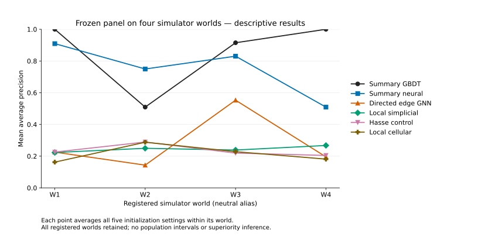
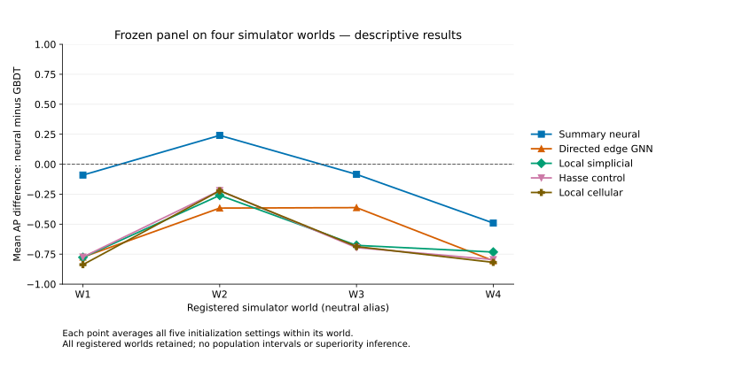

# Strong summary baselines in a four-world simulated cycle-recovery benchmark

## Abstract

We ask whether retained graph, cellular, simplicial and Hasse models improve exact persisted generated CYCLE membership recovery over summaries of the same legitimate native observations. A controlled AMLSim variant supplies complete physical-event candidate frames. Previously selected models were locked before 4 prospectively registered simulator realizations were generated once. All 120 model–world prediction blocks were completed and bound before metric labels were joined. Average precision (AP) admits tied logits together and is averaged over all initialization settings within world, then equally over worlds. The fixed-summary gradient-boosted decision tree (GBDT) achieved mean AP 0.8561; the summary neural control achieved 0.7497, and graph/complex means ranged from 0.2149 to 0.2793. The summary neural control exceeded GBDT on one world. This finite comparison preserves negative and exception results. Neural comparative learning and sustained finite stability remain unqualified, and the worlds do not establish population precision or financial efficacy. The contribution is an inspectable, transaction-preserving benchmark and a bounded baseline finding.

## Question, contribution and related work

Our question concerns exact membership in generated persisted cycle tuples, including SAR and non-SAR annotations. The comparison asks whether these particular retained representation/readout paths add measured recovery performance beyond fixed summaries. It does not estimate criminal activity. The observation contract retains individual physical events, their directions, native attributes and candidate masks; an aggregation that merges parallel transfers changes this task.

AMLSim is a synthetic transaction simulator credited to Suzumura and Kanezashi at the retained revision [AMLSIM]. Weber et al. motivate synthetic graph-learning study in anti-money laundering [WEBER2018]. CW networks [CWN2021] and message passing simplicial networks [MPSN2021] supply background for cellular and simplicial ideas. Our arms use disclosed local constructions and small readouts; they are adaptations, not faithful reproductions or refutations of those papers. Feature extraction paired with boosting is relevant prior work [GFP2024], with different tasks, features and populations. This is narrow background coverage; no published benchmark score is a measurement in this study.

The current simulator evidence is separate from earlier exploratory AMLworld, Elliptic and structural/engineering investigations. Historical repository metrics do not become current efficacy evidence. The original large AMLworld population design remains unresolved. Neither a new source nor a finite simulator comparison supplies missing population support for that design.

## Data, target and candidate census

The fixed controlled mechanism uses 32 accounts over 120 native simulator steps, 6 CYCLE templates, 2 noncycle alert templates and background transfers. It is based on pinned IBM AMLSim source with disclosed controlled-input, Java runtime and observation/persistence variants. The upstream revision and credits appear in the data card. Source code licensing does not grant release of the retained worlds or model states. Accounts and scheduling templates are shared design choices across realizations; seed changes do not demonstrate independent institutions.

Let a directed simple account cycle be an ordered distinct-account sequence modulo cyclic rotation, with length from 2 through 12. For each directed arc, take every physical persisted transfer with matching endpoints. The candidate frame is the Cartesian product of these arc-event sets for every cycle. Thus parallel equal-content transfers remain distinct; reversing direction is a different cycle. A candidate is a world-specific physical-event tuple, not an aggregated edge or an account identity. Self-loops remain in full-world context but are outside the simple candidate-cycle length frame. Cash-in/out rows are excluded from the candidate arc census. Guards reject more than 128 noncash events or 10000 candidate tuples without clipping or replacement.

A positive tuple equals one complete persisted generated CYCLE instance, reconciled through finalized membership/scheduling, arc attempts and native persisted events. Both SAR statuses are included. A nonmember is a complement of these exact annotations, not verified legitimate activity. Failed/incomplete intentions cannot silently become successful positives. Generation reconciliation accesses annotations, while scoring accesses only allowlisted observations/topology. Custody is local to one user; no externally sealed-label or independently witnessed execution claim follows.

Each realized holdout contained 77 physical transfers and 78 candidate tuples: 6 exact members and 72 nonmembers, prevalence 0.0769. These observed counts were outcomes, not acceptance criteria imposed on new draws. Candidate tuples overlap in accounts and transfers and are not independent population units. Counts across a world remain identical across model settings.

Time input is the native integer step divided by the configured number of steps; it is not a financial wall-clock time. Amount input is log1p of the actual persisted native amount. The retained Java logger truncates emitted positive double amounts toward zero at cents; reconciliation uses that persistence convention rather than nearest-cent rounding. No currency conversion, conservation, time-respecting flow or criminal interpretation is inferred.

## Representations and actual model equations

For a physical event from account u to v, the cellular boundary column has -1 at u and +1 at v, with a zero column for a loop. The candidate face boundary selects its directed cycle events. Exact integer boundary closure satisfies B₁B₂=0. Every physical event retains a separate coordinate. The simplicial representation replaces each event by account → source port → event vertex → target port → account; a fan triangulates the selected subdivided perimeter. Spokes are auxiliary geometry, not financial transfers. Native event observations occur once at event vertices. The closure and identity checks concern this construction; external persistent-homology parity remains unavailable.

Write σ for tanh and L for a trainable affine map, with independently named maps below. The cellular arm computes node hᵥ=σ(Lₙmᵥ), initial event hₑ⁰=σ(Lₑ[tₑ,aₑ,sₑ]), and face h𝒻⁰=σ(L𝒻k). Its lower message is |B₁|ᵀhᵥ, plus separately transformed source and target states. Its upper message is |B₂|h𝒻⁰. The updated event state is σ(Lᵤ[hₑ⁰, lower+directional, upper]); the face update is σ(L𝒻ᵤ[h𝒻⁰, |B₂|ᵀhₑ]). The scalar logit reads the updated face plus the mean of all world-event states. In the Hasse control, the lower message is separately transformed source and target states instead of |B₁|ᵀhᵥ; the additional directional maps and face/event readout remain. This local contrast is descriptive and does not isolate a causal topology mechanism.

The simplicial arm encodes vertex type/mask/event observations and edge-relation indicators. It computes hᵥ=σ(Lᵥv), hₑ=σ(Lₑ[σ(Lᵣe), |B₁|ᵀhᵥ]), hᵥ′=σ(Lᵥᵤ[hᵥ, |B₁|hₑ]), and h𝒻=σ(L𝒻ᵤ[σ(L𝒻f), |B₂|ᵀhₑ]). Its logit reads mean face plus mean updated vertex states. Absolute incidence removes basis-sign information from these paths; coordinate invariance does not establish signed-cochain reasoning or original MPSN semantics.

The conventional directed edge GNN computes separate incoming/outgoing event messages from endpoint node states and native event features, sums them at accounts, and updates node states. It encodes source-updated event states. Its final affine readout concatenates the masked mean of central node states, the masked mean of selected event states, and candidate length; masked denominators include the executed small positive epsilon. Whole-world topology and event attributes remain available to the neural arms.

The fixed-summary input contains cycle length; min/mean/max/population-SD of selected time and log amount; their spans; min/mean/max central full-world in/out degree; and min/mean/max selected directed-pair multiplicity. These are lossy summaries of legitimate observations, not identical tensors to graph inputs. GBDT receives unnormalized float64 summaries. The summary network is affine–ReLU–affine–ReLU–affine with input dimension 20, hidden width 81 in each hidden layer, and output dimension 1. The original training-only population mean/SD transform is applied in float64, exact constant columns use scale one, then neural tensors become float32. No transform is fit on validation or holdout rows.

| Arm family | Accessible observation | Representation/readout | Training opportunity |
|---|---|---|---|
| Directed GNN | Full world events/topology, native attributes and masks | Directional sum messages; masked node/event pooling | Development grid and continuation |
| Cellular and Hasse | Same physical event observations and candidate face | Absolute incidence or local endpoint paths; face/world-event pooling | Development grid and continuation |
| Simplicial | Same observations via event-port vertices | Absolute incidence; mean face/vertex pooling | Development grid and continuation |
| Summary neural | Fixed selected/context summaries | Training-only normalization; ReLU network | Separate summary rate grid |
| GBDT | Same fixed summaries | Unnormalized tree boosting, selected staged round | Leaf grid and bounded extension |

Parameter matching does not match optimization/tuning opportunity. Architecture sizes, selected checkpoints and histories are reported rather than used to assert comprehensive fairness. Persistent homology is not an evaluated learned holdout arm, and no standalone temporal predictor was deployed.

## Development learning and selection history

The whole-world development split has 4 training and 2 validation worlds, aliased separately from holdout. Initial fitting and extensions retain 100 trial summaries. Neural development used Adam, unweighted equal-world binary cross-entropy and validation-only checkpoint selection. Initial learning-rate and GBDT leaf grids, best epochs/iterations and per-trial measured durations appear in separate complete tables. The continuation compares declared candidate rates across all settings, retains the original history, and selects the lowest mean best equal-world validation BCE, with the lower-rate tie rule. Checkpoint ties keep the earlier epoch. Scheduler reductions and terminal endpoints do not redefine selected checkpoints.

| Arm | Hidden width | Active neural parameters | Selected rate | Selected epochs in setting order |
|---|---:|---:|---:|---|
| Fixed-summary neural control | 81 / 81 | 8425 | 0.001 | 375, 375, 575, 300, 375 |
| Directed local edge GNN | 36 | 8390 | 0.03 | 875, 825, 690, 780, 1125 |
| Local simplicial MPSN-style | 36 | 8533 | 0.03 | 800, 925, 925, 750, 1150 |
| Cellular Hasse control | 30 | 8431 | 0.01 | 1125, 1350, 3375, 670, 1275 |
| Local cellular CWN-style | 34 | 8467 | 0.01 | 1000, 1175, 1450, 1225, 1600 |

The initial neural rate grid was 0.0001, 0.001, 0.01; the GBDT maximum-leaf grid was 3, 7, 15; the separate summary rate grid was 0.001, 0.01, 0.03. All candidate settings and extensions are retained. GBDT uses one-based staged round 70 selected in development from retained 800-round fitted objects. Its frozen policy and summary architecture are documented in the linked methods. It was not refit on holdout. Width/count similarity does not resolve learning: only 2 of 20 selected graph continuation runs recorded sustained local stability under the finite diagnostic. No summary trial among 15 established that rule. Low training loss or an epoch cap is not a proof of convergence.

All 60 graph/complex microfit trials met their declared fitting endpoint on a deliberately label-conditioned balanced training subset. The subset chooses exact members and nonmembers in each training world. Endpoint success establishes fitting capability on those rows only; it does not establish full-corpus adequacy, generalization or a topology mechanism. None of these microfit states was deployed. Selection measurements, terminal learning measurements and microfit endpoints are exported with distinct record types and splits.

## Prospective holdout protocol and estimand

The protocol and 30 selected states were locked before generating the 4 registered worlds. Every draw was attempted once without reassignment or replacement. All worlds were materialized before scoring. Each arm retained 5 settings; neutral aliases preserve registered order. The scoring path opened the blind observation/topology inventory and completed all 120 prediction blocks before labels were joined. There was no holdout fitting, tuning, threshold calibration, ensemble selection or successful-block rescoring. These worlds are now exposed.

For descending distinct logit thresholds, grouped AP is Σᵦ(Δrecallᵦ)precisionᵦ; all exactly equal scores enter together. AUROC awards half credit to positive/nonmember ties. BCE is the mean of logaddexp(0,z)−yz. The predeclared confusion threshold is raw logit ≥0.0, without calibration. A world with no positives has AP unavailable; a single-class world has AUROC unavailable. Undefined metrics remain null with reasons, and a missing required AP blocks the overall primary mean rather than dropping a world. Every required primary endpoint was defined in the retained pass.

The primary descriptive observable is mean AP over all settings within each world, followed by an equal mean over all worlds. It is neither candidate-pooled AP nor AP of averaged logits. Each neural-minus-GBDT contrast uses those world means. All contrast families are retained. The independent unit for this finite description is the generator realization conditional on fixed design; candidates and initializations do not increase the world count. The active support floor of 30 worlds remains unmet. No population intervals, p-values, equivalence estimate or justified population precision is available.

## Complete results

| Retained arm | W1 | W2 | W3 | W4 | Equal-world mean |
|---|:---:|:---:|:---:|:---:|:---:|
| Fixed-summary GBDT | 1.0000 | 0.5093 | 0.9151 | 1.0000 | 0.8561 |
| Fixed-summary neural control | 0.9095 | 0.7497 | 0.8304 | 0.5092 | 0.7497 |
| Directed local edge GNN | 0.2254 | 0.1434 | 0.5530 | 0.1955 | 0.2793 |
| Local simplicial MPSN-style | 0.2230 | 0.2496 | 0.2385 | 0.2675 | 0.2447 |
| Cellular Hasse control | 0.2259 | 0.2892 | 0.2194 | 0.2045 | 0.2348 |
| Local cellular CWN-style | 0.1623 | 0.2879 | 0.2282 | 0.1813 | 0.2149 |

The fixed-summary GBDT has the higher whole-panel mean than each graph/complex arm; the summary neural control also has the higher mean than every graph/complex arm. The complete world columns preserve the summary-neural advantage on W2. GBDT's perfect AP on W1, W4 is retained as a finite observed result: saved-byte arithmetic and native annotation/source joins were checked in the completed local review. It is not evidence of universal cycle detection. The full per-setting metrics include secondary measures and every zero-logit confusion record; class imbalance and threshold errors should be read alongside AP.

| Neural arm minus GBDT | W1 | W2 | W3 | W4 | Equal-world mean |
|---|:---:|:---:|:---:|:---:|:---:|
| Fixed-summary neural control | -0.0905 | +0.2404 | -0.0847 | -0.4908 | -0.1064 |
| Directed local edge GNN | -0.7746 | -0.3659 | -0.3621 | -0.8045 | -0.5768 |
| Local simplicial MPSN-style | -0.7770 | -0.2596 | -0.6766 | -0.7325 | -0.6114 |
| Cellular Hasse control | -0.7741 | -0.2201 | -0.6957 | -0.7955 | -0.6213 |
| Local cellular CWN-style | -0.8377 | -0.2214 | -0.6868 | -0.8187 | -0.6411 |

Figure: AP for every arm on every registered world, averaging all initialization settings within world. The axes use metric units, with no population error bars. Connecting lines aid comparison across aliases rather than representing a time series.

Figure: Every predeclared neural-minus-GBDT AP difference by world. The zero line marks equality of the finite means. Signs are descriptive; unresolved learning and support prevent qualified superiority or equivalence interpretation.

The [complete metric table](../results/s1_benchmark/metrics_by_world_initialization.csv), [world means](../results/s1_benchmark/ap_by_world.csv), [contrast family](../results/s1_benchmark/ap_contrasts.csv), and [machine-readable summary](../results/s1_benchmark/summary.json) retain unrounded values. Supplemental development tables are [initial trials](../results/s1_benchmark/development_initial_trials.csv), [initial selected validation](../results/s1_benchmark/development_selected_metrics.csv), [continuation selected/terminal metrics](../results/s1_benchmark/development_continuation_metrics.csv), [continuation policy/stability](../results/s1_benchmark/development_continuation_status.csv), and [learning diagnostic trials/selections/endpoints](../results/s1_benchmark/learning_diagnostic_trials.csv). Their dictionary preserves scope and missingness. Development records are never pooled into holdout performance.

## Negative findings, failure analysis and limitations

The weak frozen graph-arm AP is a legitimate retained outcome. It cannot establish intrinsic architectural inferiority because full-corpus optimization and finite stability are unresolved. Conversely, successful microfits do not repair that qualification. A strong baseline is evidence that legitimate summaries capture useful signal in these small generator realizations; deleting that signal to make another representation competitive would change the question.

Existing development column-permutation and native-span investigations point to schedule cues of this generator. They remain development-only evidence, not a new holdout temporal model or a causal intervention. The study did not establish matched causal ablations, sensitivity, external PH backend parity, broader/OOD validation or financial generalization. No new subgroup ranking/efficacy analysis is introduced. Existing threshold confusion records and all exceptions remain available.

The fixed tiny template limits mechanism variation. Shared accounts/schedules, candidate overlap and same-user custody limit the interpretation of nominally distinct seeds. No exact normalized predictor-input duplicate was found in the retained review; absence of byte-level duplicates is not graph-isomorphism detection or proof of independent institutions. Review occurred in the same session after exposure to the conclusion. Independently written saved-metric arithmetic and source joins support local consistency; they supply no cold or externally independent reviewer/label-custody assurance.

## Measured cost, reproducibility and availability

The retained holdout interval was 12.139 seconds, including preliminary work; it is a single measured interval, not a repeated runtime distribution or larger-campaign forecast. The early output-tree count was 10653086 bytes before cost/final manifest completion. The retained final tree was 10654055 bytes; outer launch files and the original report add 3565 bytes. Local review/assembly outputs have separate scope. Recorded wrapper peak RSS was 253362176 bytes and maximum child peak RSS was 771162112 bytes; they are separate scopes and cannot be summed as simultaneous memory. The original ceiling concerns generated output, not RAM. Development resource measurements with their separate scopes are in the summary. Energy, thermal telemetry and campaign affordability were not measured.

Released CSV arithmetic and figure reproduction require only ordinary Python plotting dependencies and the supplied aggregate rows. The new synthetic fixtures check coverage, missingness, averaging and figure output; they contain no empirical predictors. The actual raw worlds, prediction rows, labels, model states and operational records are withheld. A clone can inspect methods and regenerate the released figures but cannot rerun the empirical comparison. No empirical artifact archive is distributed. Project rights remain governed by the existing proprietary license; AMLSim's Apache-2.0 notice describes its upstream source only.

## Ethics, assistance and conclusion

These are synthetic generated annotations, not criminal truth or verified noncriminal activity. No real personal financial records are claimed for this simulator benchmark. It supplies no screening/deployment recommendation or real institutional efficacy. Human authorship, affiliations and funding are not asserted in this draft. Automated coding, evidence-export, prose and figure assistance was provided by OpenAI Codex; empirical interpretation requires human responsibility and scientific review. This record does not invent independent peer review.

For this fixed panel and these simulator worlds, retained GBDT mean AP exceeds graph/complex-arm means, while the summary neural exception remains visible. The evidence is conditional development evidence. Learning qualification, population precision and broader mechanism/generalization claims remain unresolved. This draft assembles the completed comparison without additional empirical rescue.

## References

- [AMLSIM] Toyotaro Suzumura and Hiroki Kanezashi (repository citation). [AMLSim](https://github.com/IBM/AMLSim/blob/7338a4bcb1af9bcfea2201ad7daccfe2a4d569ca/README.md) (2021).
- [AMLSIM_LICENSE] [AMLSim source license at retained revision](https://github.com/IBM/AMLSim/blob/7338a4bcb1af9bcfea2201ad7daccfe2a4d569ca/LICENSE).
- [WEBER2018] Weber et al.. [Scalable Graph Learning for Anti-Money Laundering: A First Look](https://arxiv.org/abs/1812.00076) (2018).
- [CWN2021] Bodnar et al.. [Weisfeiler and Lehman Go Cellular: CW Networks](https://proceedings.neurips.cc/paper/2021/hash/157792e4abb490f99dbd738483e0d2d4-Abstract.html) (2021). NeurIPS34.
- [MPSN2021] Bodnar et al.. [Weisfeiler and Lehman Go Topological: Message Passing Simplicial Networks](https://proceedings.mlr.press/v139/bodnar21a.html) (2021). ICML, PMLR139:1026-1037.
- [GFP2024] Blanusa et al.. [Graph Feature Preprocessor: Real-time Subgraph-based Feature Extraction for Financial Crime Detection](https://arxiv.org/abs/2402.08593) (2024).
- [AP_DOC] scikit-learn developers. [average_precision_score documentation](https://scikit-learn.org/1.9/modules/generated/sklearn.metrics.average_precision_score.html).
